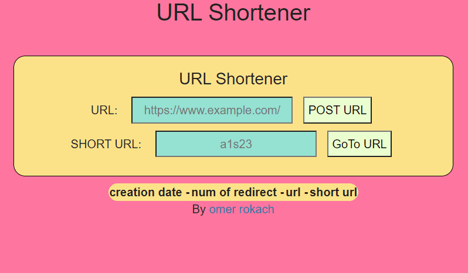
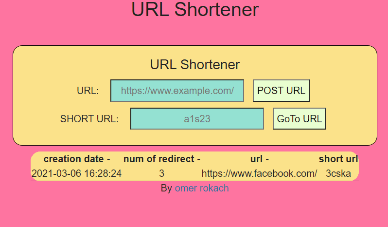

#  Final 1 - URL shortner 📎

In this project you will create your own [URL shortener](https://en.wikipedia.org/wiki/URL_shortening)!

This repository includes a basic template for starting the project:
## my url-shortner app
you can copy ant link you would like to short and pass it in the url input off the app, the app will return you a string of 5 chars 
0-9 and a-z. you can pass it on the url bar up on the window like this: 'http'://localhost:3000/api/shorturl/'the short string' or 
you can type it in the short url input and go to the url with the "GoTo URL" button.

## about the app
all the work was about practice client side and the backend and data base side. all the data in the app is saved in a web data base "json bin", and in local in the client files as json files.
all the app self and auto tested by "jest" and "super test".

## some of the extras
- i used json bin web and the local files for keeping the data persistent.
- Serve a styled statistics dashboard instead of the default JSON statistics.
- Used supertest/puppeteer test to test my bonus feature i implemented. 
- errors shown for the client clearly and accurately for the problem.

